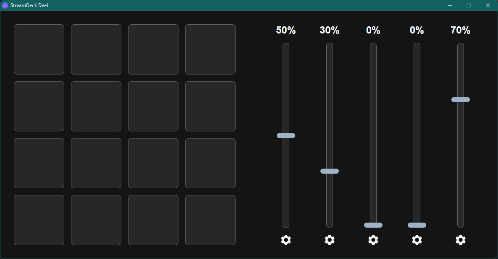
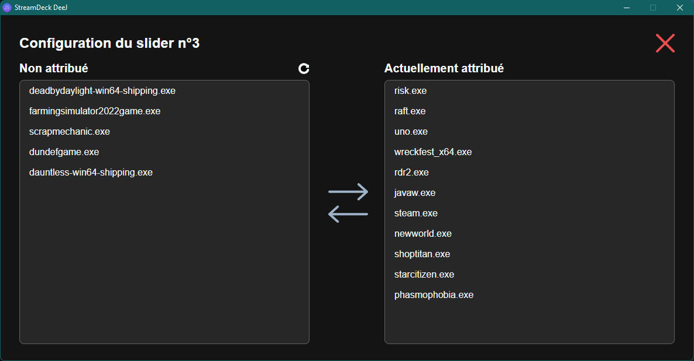

# StreamDeckDeeJ-App

StreamDeckDeeJ-App est le client bureau pour [StreamDeckDeeJ](https://github.com/lachaux-remi/StreamDeckDeeJ). Il permet de gérer la configuration et la communication entre [StreamDeckDeeJ-Arduino](https://github.com/lachaux-remi/StreamDeckDeeJ-Arduino).



## Configuration

StreamDeckDeeJ-App utilise un simple fichier de configuration au format YAML nommé [`config.yaml`](./config.yaml), placé à côté de l'exécutable.

Le fichier de configuration détermine quelles applications (et appareils) sont mappés sur quels curseurs et quels paramètres utiliser pour la connexion à la carte Arduino, ainsi que d'autres préférences de l'utilisateur.

**Ce fichier se recharge automatiquement lorsque son contenu est modifié, vous pouvez donc modifier les mappages d'application à la volée sans redémarrer l'application.**

Il ressemble à ceci :

```yaml
slider_mapping:
  "0":
    - master
  "1":
    - chrome.exe
    - firefox.exe
  "2":
    - spotify.exe
    - disneyplus.exe
  "3":
    - steam.exe
    - uno.exe
    - rdr2.exe
    - newworld.exe
    - starcitizen.exe
    - phasmophobia.exe
  "4":
    - discord.exe
    
# set this to true if you want the controls inverted (i.e. top is 0%, bottom is 100%)
invert_sliders: false

# settings for connecting to the arduino board
com_port: COM3
baud_rate: 115200
```

Il est aussi configurable via l'interface graphique.



## License
StreamDeckDeeJ is released under the [MIT license](./LICENSE).
